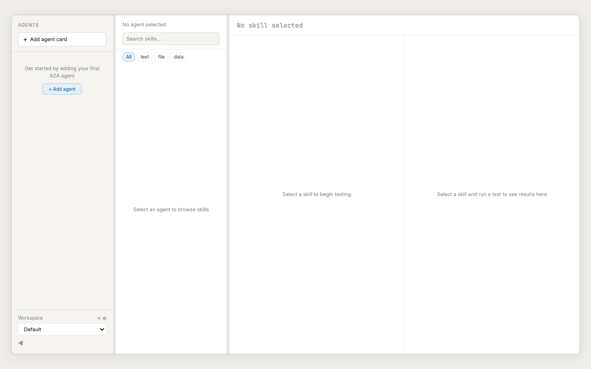
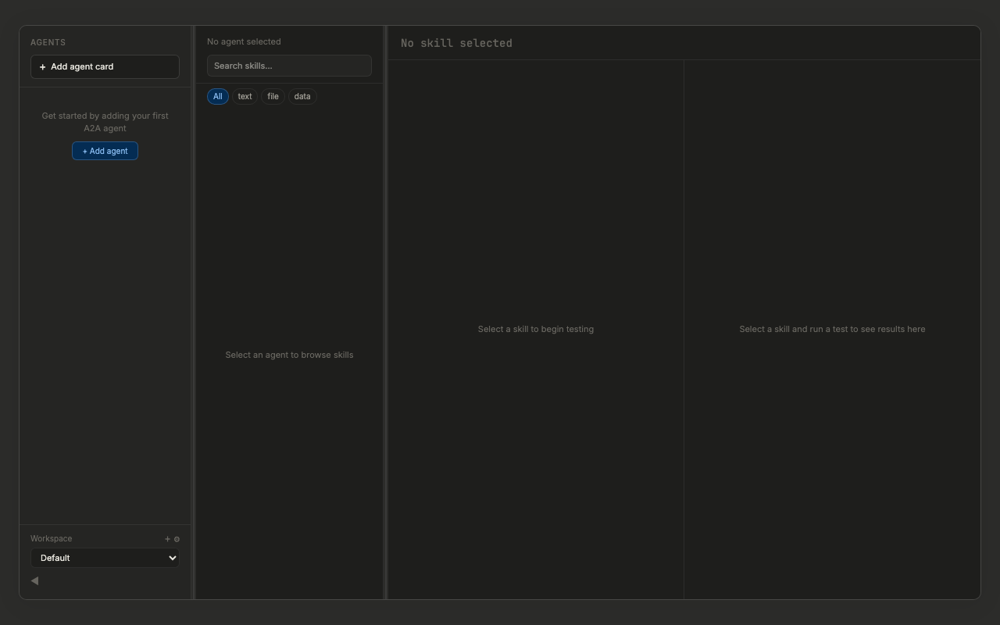

<div align="center">

# 🔨 A2A-Forge

**The desktop workbench for testing and debugging A2A protocol agents**

[](https://github.com/learningpro/a2a-forge/actions)
[](LICENSE)
[](https://v2.tauri.app/)
[](https://react.dev/)

[中文](README_CN.md) | English

---



<sub>Three-panel layout: agents sidebar · skill browser · test panel with live results</sub>



<sub>Dark mode with system-aware theme detection</sub>

</div>

---

## What is A2A-Forge?

A2A-Forge is a native desktop application for developers building [A2A (Agent-to-Agent)](https://google.github.io/A2A/) protocol agents. Think of it as **Postman for A2A** — add any agent by URL, browse its skills, and run live test interactions without writing code.

Built with [Tauri 2](https://v2.tauri.app/) for a fast, lightweight, cross-platform experience.

## Features

- 🔍 **Agent Discovery** — Fetch and inspect `.well-known/agent.json` agent cards instantly
- ⚡ **Skill Testing** — Invoke any skill with adaptive input (text, JSON, file upload)
- 📡 **Live Streaming** — SSE-based streaming with real-time status updates for async tasks
- 🔐 **Secure Auth** — Per-agent default headers with OS keychain credential storage
- 🖼️ **Smart Preview** — Auto-detect and render images, video, and audio inline
- 📋 **Curl Export** — Copy equivalent curl commands with one click
- 📜 **History** — Searchable execution history with saved test cases
- 🗂️ **Workspaces** — Organize agents into separate workspaces
- 🌗 **Themes** — System-aware dark/light mode with manual override
- ⌨️ **Keyboard First** — `Ctrl+N` add agent · `Ctrl+Enter` run · `Ctrl+Shift+C` copy curl

## Quick Start

### Prerequisites

- [Rust](https://rustup.rs/) (stable toolchain)
- [Node.js](https://nodejs.org/) v18+
- Platform dependencies: see [Tauri Prerequisites](https://v2.tauri.app/start/prerequisites/)

### Install & Run

```bash
git clone https://github.com/learningpro/a2a-forge.git
cd a2a-forge
npm install
npm run tauri dev
```

### Build for Production

```bash
npm run tauri build
# Output: .dmg (macOS) / .msi + .exe (Windows)
```

## Usage

### 1. Add an Agent

Click **+ Add agent card** or press `Ctrl/Cmd+N`. Enter the agent's base URL — A2A-Forge fetches the card from `/.well-known/agent.json` and displays all available skills.

### 2. Configure Auth

Click the ⚙️ gear icon next to the agent name to set default headers (e.g., `X-API-Key`). These persist across sessions and apply to all skill tests for that agent.

### 3. Test a Skill

Select a skill → write your input → click **Run** (or `Ctrl/Cmd+Enter`). The response viewer renders results with smart media detection — images display inline, videos play in-app, JSON is syntax-highlighted.

### 4. Review & Iterate

Every execution is saved to history. Save frequently-used requests as named test cases for one-click re-run. Copy the equivalent curl command to share with teammates.

## Tech Stack

| Layer | Technology |
|-------|-----------|
| Runtime | [Tauri 2.x](https://v2.tauri.app/) (Rust) |
| Frontend | React 18 + TypeScript |
| Styling | [Tailwind CSS 4](https://tailwindcss.com/) |
| State | [Zustand 5](https://zustand-demo.pmnd.rs/) |
| Database | SQLite (via tauri-plugin-sql) |
| Type Bridge | [tauri-specta](https://github.com/oscartbeaumont/tauri-specta) |
| Editor | [Monaco Editor](https://microsoft.github.io/monaco-editor/) |

## Roadmap

### v0.1 — Current Release ✅

Agent card management, skill browser, adaptive test input, async task execution with auto-polling, SSE streaming, response viewer with smart media preview, test history, saved test cases, per-agent auth headers, workspaces, settings, keyboard shortcuts.

### v0.2 — Automated Testing

- [ ] Test suites — group test cases into automated sequences
- [ ] Assertions — define expected outputs and auto-validate
- [ ] CI integration — run test suites from command line
- [ ] Test reports — export results as HTML/JSON

### v0.3 — Local Registry Proxy

- [ ] Local A2A registry — act as a proxy for agent discovery
- [ ] Request/response interception and modification
- [ ] Latency simulation and fault injection
- [ ] Traffic recording and replay

### v0.4 — Community Hub

- [ ] Community agent directory — discover and load popular A2A agents
- [ ] Shared test collections — import/export community test suites
- [ ] Agent health monitoring — periodic card refresh with alerts
- [ ] Favorites — star and organize frequently-used agents

### v0.5 — Advanced Workspace

- [ ] Workspace sharing — export/import full workspace configs
- [ ] Environment variables — per-workspace variable substitution
- [ ] Request chaining — pipe output of one skill into another
- [ ] Diff view — compare responses across runs

## Contributing

Contributions are welcome! Please open an issue or submit a pull request.

```bash
npm run tauri dev        # Start dev server
npx tsc --noEmit         # Type check
npx vitest run           # Run tests
```

## License

[MIT](LICENSE) — Copyright 2026 Orange Dong
